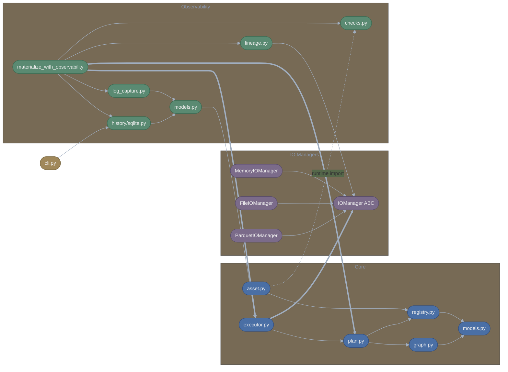
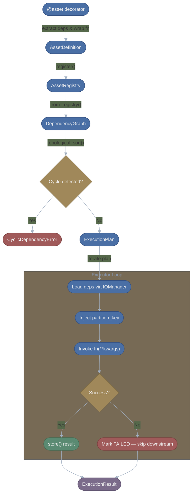
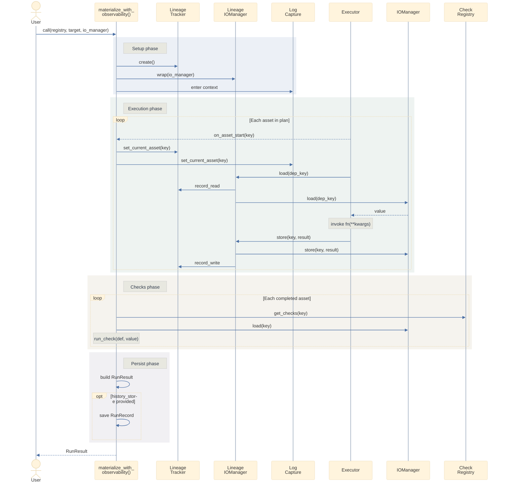
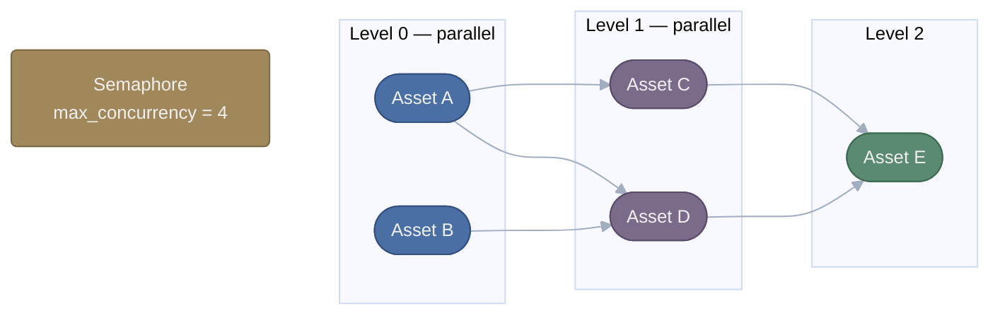

# Lattice Core Architecture

This document maps how the core Lattice classes and functions interact, covering the full asset lifecycle from definition through execution and observability. The web interface layer is documented separately in [web_architecture.md](web_architecture.md).

---

## Table of Contents

1. [Module Overview](#module-overview)
2. [Asset Definition & Registry](#asset-definition--registry)
3. [Dependency Graph & Execution Planning](#dependency-graph--execution-planning)
4. [Execution Engine](#execution-engine)
5. [IO Manager Abstraction](#io-manager-abstraction)
6. [Observability Stack](#observability-stack)
7. [CLI Interface](#cli-interface)
8. [Diagrams](#diagrams)

---

## Module Overview

```
src/lattice/
├── __init__.py              # Public API exports
├── asset.py                 # @asset decorator and dependency extraction
├── models.py                # AssetKey, AssetDefinition (Pydantic models)
├── graph.py                 # DependencyGraph with topological sort & cycle detection
├── executor.py              # Executor & AsyncExecutor for materialization
├── plan.py                  # ExecutionPlan resolution
├── registry.py              # AssetRegistry (global + custom)
├── exceptions.py            # CyclicDependencyError
├── cli.py                   # Command-line interface for run history
│
├── io/                      # Asset storage backends
│   ├── base.py              # IOManager ABC
│   ├── memory.py            # In-memory storage
│   ├── file.py              # Filesystem storage (pickle)
│   └── parquet.py           # Parquet file storage (Polars)
│
├── logging/                 # Logging configuration
│   ├── config.py            # configure_logging(), get_logger()
│   └── logging.conf         # Default INI-style log config
│
└── observability/           # Execution monitoring & history
    ├── __init__.py          # materialize_with_observability()
    ├── checks.py            # CheckDefinition, CheckRegistry, AssetWithChecks
    ├── models.py            # CheckResult, LogEntry, LineageEvent, RunResult, RunRecord
    ├── lineage.py           # LineageTracker, LineageIOManager
    ├── log_capture.py       # ExecutionLogHandler, capture_logs()
    └── history/
        ├── base.py          # RunHistoryStore ABC
        └── sqlite.py        # SQLiteRunHistoryStore
```

### Circular Import Avoidance

Several modules use the `TYPE_CHECKING` guard to break circular dependencies at runtime while preserving static type checking:

- `asset.py` imports `AssetWithChecks` from `observability/checks.py` inside `_asset_decorator()` at runtime, but at module level only under `TYPE_CHECKING`.
- `graph.py` imports `AssetRegistry` from `registry.py` only under `TYPE_CHECKING`, using a string annotation `"AssetRegistry"` in method signatures.
- `exceptions.py` imports `AssetKey` from `models.py` only under `TYPE_CHECKING`.
- `executor.py` imports `AssetRegistry` from `registry.py` only under `TYPE_CHECKING`, with a local import inside `AsyncExecutor.execute()`.

---

## Asset Definition & Registry

### AssetKey

`models.py` &mdash; Immutable, hashable identifier for an asset.

| Field | Type | Default | Description |
|-------|------|---------|-------------|
| `name` | `str` | *(required)* | Asset name (min 1 char) |
| `group` | `str` | `"default"` | Namespace for organization (min 1 char) |

- `__str__()` returns `"group/name"` when group is not `"default"`, otherwise just `"name"`.
- `__hash__()` hashes `(group, name)`, enabling use as dict keys and in sets.
- Frozen via `ConfigDict(frozen=True)`.

### AssetDefinition

`models.py` &mdash; Metadata wrapper for an asset function.

| Field | Type | Default | Description |
|-------|------|---------|-------------|
| `key` | `AssetKey` | *(required)* | Unique identifier |
| `fn` | `Callable[..., Any]` | *(required)* | The wrapped asset function |
| `dependencies` | `tuple[AssetKey, ...]` | `()` | Assets this asset depends on |
| `dependency_params` | `tuple[str, ...]` | `()` | Parameter names for each dependency (same order) |
| `return_type` | `Any` | `None` | Return type annotation |
| `description` | `str \| None` | `None` | Human-readable description |

- `__call__()` delegates to `fn`, making the definition callable.
- `__hash__()` hashes by `key`.
- Invariant: `len(dependencies) == len(dependency_params)`.

### AssetRegistry

`registry.py` &mdash; Thread-safe container for asset definitions.

| Method | Signature | Description |
|--------|-----------|-------------|
| `register` | `(asset: AssetDefinition) -> None` | Register asset; raises `ValueError` on duplicate key |
| `get` | `(key: AssetKey \| str) -> AssetDefinition` | Retrieve by key; raises `KeyError` if missing |
| `__contains__` | `(key: AssetKey \| str) -> bool` | Membership check |
| `__iter__` | `() -> Iterator[AssetDefinition]` | Iterate all definitions |
| `__len__` | `() -> int` | Count of registered assets |
| `clear` | `() -> None` | Remove all assets |

**Global singleton:** `get_global_registry()` returns a module-level `AssetRegistry`. The `@asset` decorator registers to this by default. Custom registries can be passed via `@asset(registry=my_registry)` for test isolation.

### The `@asset` Decorator

`asset.py` &mdash; Two calling conventions:

```python
# Direct decoration (no arguments)
@asset
def my_asset() -> int: ...

# Parameterized decoration
@asset(key=AssetKey(name="custom", group="analytics"), deps={...}, description="...")
def my_asset(source: dict) -> int: ...
```

**Internal flow (`_asset_decorator`)** &mdash; see [Decorator Execution Step-by-Step](#decorator-execution-step-by-step) for the full walkthrough:

1. **Resolve key** &mdash; Use provided key or derive from `func.__name__`.
2. **Extract dependencies** (`_extract_dependencies`) &mdash; Inspect function parameters. Each parameter becomes a dependency (as `AssetKey(name=param_name)`), unless it appears in the skip list (`self`, `cls`, `context`, `partition_key`) or has an explicit mapping via `deps`.
3. **Extract return type** (`_extract_return_type`) &mdash; Safely read type hints via `get_type_hints()`.
4. **Wrap function** &mdash; `_create_sync_wrapper` or `_create_async_wrapper` (preserves `__name__`, `__doc__`, and async detection via `@wraps`).
5. **Create `AssetDefinition`** with all extracted metadata.
6. **Register** to the target registry.
7. **Return `AssetWithChecks`** wrapping the definition, enabling `.check()` chaining.

### Decorator Execution Step-by-Step

When Python encounters `@asset` on a function definition, the following sequence executes at **import time** (not at materialization time):

#### Step 1: Dispatch — `@asset` vs `@asset(...)`

The `asset()` function uses `@overload` to support two calling conventions. Python resolves this at decoration time:

- **`@asset` (no parentheses):** Python passes the decorated function directly as `fn`. Since `fn is not None`, `_asset_decorator()` is called immediately with the function and default arguments.
- **`@asset(key=..., deps=...)` (with arguments):** Python calls `asset(key=..., deps=...)` first, which returns a lambda. Python then calls that lambda with the decorated function, which in turn calls `_asset_decorator()`.

Both paths converge on `_asset_decorator(func, key, deps, description, target_registry)`.

#### Step 2: Resolve the Asset Key

```python
asset_key = key or AssetKey(name=func.__name__)
```

If no explicit `key` is provided, the function's `__name__` attribute becomes the asset name in the `"default"` group. For example, `def daily_revenue()` produces `AssetKey(name="daily_revenue", group="default")`.

#### Step 3: Extract Dependencies (`_extract_dependencies`)

The decorator inspects the function's signature using `inspect.signature(fn)` and iterates every parameter:

1. **Skip reserved parameters** — `self`, `cls`, `context`, and `partition_key` are excluded since they serve framework purposes rather than representing upstream assets.
2. **Check explicit mapping** — If `deps` was provided (e.g., `deps={"revenue": AssetKey(name="daily_revenue", group="analytics")}`), parameters in that dict resolve to the specified `AssetKey`.
3. **Derive by name** — Parameters not in the skip list or explicit mapping become `AssetKey(name=param_name)` in the default group.

The function returns two parallel tuples: `dependencies` (the `AssetKey` objects) and `dependency_params` (the corresponding parameter names), preserving insertion order.

**Why `deps` mirrors parameter names:**

By default, the decorator derives dependencies purely from parameter names — `def my_asset(raw_users)` automatically depends on `AssetKey(name="raw_users", group="default")`. This convention-over-configuration approach works when the parameter name matches the upstream asset's registered name in the default group. However, it breaks down in two cases:

1. **Non-default groups** — An asset registered as `AssetKey(name="daily_revenue", group="analytics")` cannot be resolved from a parameter named `daily_revenue` alone, because the decorator would derive `AssetKey(name="daily_revenue", group="default")` — wrong group.
2. **Name aliasing** — A function may want a shorter or more meaningful local variable name (e.g., `revenue`) than the upstream asset's registered name (`daily_revenue`).

The `deps` parameter solves both by providing an explicit mapping from parameter name to `AssetKey`. The keys in the `deps` dict must match the function's parameter names because `_extract_dependencies()` iterates `inspect.signature(fn).parameters` and looks up each parameter name in the `deps` dict. This is how the framework knows which registry key to load and which function argument to inject the value into at execution time.

At execution time, the executor uses the parallel tuples produced by this step:

```python
# dependency_params = ("revenue", "stats")
# dependencies     = (AssetKey("daily_revenue", "analytics"), AssetKey("user_stats", "analytics"))

for param_name, dep_key in zip(asset_def.dependency_params, asset_def.dependencies):
    kwargs[param_name] = io_manager.load(dep_key)
#   kwargs["revenue"]  = io_manager.load(AssetKey("daily_revenue", "analytics"))

asset_def.fn(**kwargs)
# dashboard(revenue=<loaded value>, stats=<loaded value>)
```

So the apparent duplication between `deps={"revenue": ...}` and `def dashboard(revenue: ...)` is intentional — `deps` maps the parameter name to the correct registry key, and the parameter name is the local variable the function receives.

**Example:**

```python
@asset(deps={
    "revenue": AssetKey(name="daily_revenue", group="analytics"),
    "stats": AssetKey(name="user_stats", group="analytics"),
})
def dashboard(revenue: dict, stats: dict, partition_key: date) -> dict: ...
```

Produces:
- `dependencies = (AssetKey("daily_revenue", "analytics"), AssetKey("user_stats", "analytics"))`
- `dependency_params = ("revenue", "stats")`
- `partition_key` is skipped

Without `deps`, the decorator would derive `AssetKey(name="revenue", group="default")` and `AssetKey(name="stats", group="default")` — neither of which exist in the registry, causing a `KeyError` at execution time.

#### Step 4: Extract Return Type (`_extract_return_type`)

Calls `typing.get_type_hints(fn)` to read the return annotation. This is wrapped in a `try/except` because `get_type_hints()` can fail on forward references or missing imports. On failure, `None` is returned — the asset proceeds without type information.

#### Step 5: Create Wrapper Function

The decorator detects whether the function is async or sync via `inspect.iscoroutinefunction(func)` and creates the appropriate wrapper:

- **Async functions** → `_create_async_wrapper()` produces an `async def` wrapper that `await`s the original.
- **Sync functions** → `_create_sync_wrapper()` produces a plain `def` wrapper that calls the original.

Both wrappers use `@functools.wraps(func)` to preserve `__name__`, `__doc__`, and `__module__` from the original function. This matters downstream because the executor, logging, and web UI reference `fn.__name__` for display and error messages.

#### Step 6: Build `AssetDefinition`

All extracted metadata is assembled into a frozen Pydantic model:

```python
AssetDefinition(
    key=asset_key,               # From Step 2
    fn=wrapped_fn,               # From Step 5
    dependencies=dependencies,   # From Step 3
    dependency_params=dependency_params,  # From Step 3
    return_type=return_type,     # From Step 4
    description=description or func.__doc__,  # Explicit or docstring
)
```

The invariant `len(dependencies) == len(dependency_params)` is guaranteed by `_extract_dependencies()` building both lists in lockstep.

#### Step 7: Register to Registry

```python
target_registry.register(asset_def)
```

The registry is either the global singleton (from `get_global_registry()`) or a custom registry passed via `@asset(registry=my_registry)`. Registration:

- Raises `ValueError` if an asset with the same key already exists.
- Logs the registration at `INFO` level and the dependency list at `DEBUG` level.

Because this happens at import time, simply importing a module that defines `@asset`-decorated functions causes them to register globally.

#### Step 8: Return `AssetWithChecks`

```python
return AssetWithChecks(asset_def)
```

The decorator replaces the original function with an `AssetWithChecks` wrapper. This wrapper:

- Delegates all attribute access (`key`, `fn`, `dependencies`, etc.) to the underlying `AssetDefinition`.
- Exposes a `.check()` method for attaching data quality checks (see [AssetWithChecks](#assetwithchecks) below).
- Is callable — `my_asset()` invokes `asset_def.fn()` — so the function remains usable outside the framework.

### AssetWithChecks

`observability/checks.py` &mdash; Wrapper returned by `@asset` that enables the `.check()` decorator API.

```python
@my_asset.check
def value_positive(data: dict) -> bool:
    return data["value"] > 0

@my_asset.check(name="custom_name", description="Validates value range")
def value_in_range(data: dict) -> bool:
    return 0 < data["value"] < 100
```

- Delegates all attribute access (`key`, `fn`, `dependencies`, etc.) to the underlying `AssetDefinition`.
- `.check()` creates a `CheckDefinition` and registers it to the `CheckRegistry`.
- Returns the original check function unchanged (supports stacking multiple checks).

---

## Dependency Graph & Execution Planning

### DependencyGraph

`graph.py` &mdash; Immutable graph of asset dependencies with traversal operations.

| Field | Type | Description |
|-------|------|-------------|
| `adjacency` | `dict[AssetKey, tuple[AssetKey, ...]]` | Forward edges: asset -> its dependencies |
| `reverse_adjacency` | `dict[AssetKey, tuple[AssetKey, ...]]` | Reverse edges: asset -> its dependents |

**Construction:**

```python
graph = DependencyGraph.from_registry(registry)
```

`from_registry()` iterates all registered assets, builds both adjacency maps in O(V+E) time, and returns a frozen instance.

**Cycle Detection** (`detect_cycles`) &mdash; DFS three-color algorithm:

| Color | Value | Meaning |
|-------|-------|---------|
| WHITE | 0 | Not yet visited |
| GRAY | 1 | On current recursion stack |
| BLACK | 2 | Fully explored |

The helper `_dfs_cycle_detect()` walks the graph. A back-edge (edge to a GRAY node) indicates a cycle. The cycle path is reconstructed by walking the parent chain. External dependencies (not in the graph) are skipped. Returns `list[list[AssetKey]]` of cycles or `None`.

**Topological Sort** (`topological_sort`) &mdash; Kahn's algorithm:

1. Compute in-degree for each node (count of internal dependencies).
2. Enqueue all nodes with in-degree 0 (source assets).
3. Dequeue a node, append to result, decrement in-degree of all dependents.
4. When a dependent reaches in-degree 0, enqueue it.
5. If result length != node count, a cycle exists &mdash; raises `CyclicDependencyError`.

**Traversal methods:**

| Method | Returns | Description |
|--------|---------|-------------|
| `get_all_upstream(key)` | `set[AssetKey]` | All transitive dependencies (iterative DFS on `adjacency`) |
| `get_all_downstream(key)` | `set[AssetKey]` | All transitive dependents (iterative DFS on `reverse_adjacency`) |
| `get_execution_levels(keys?)` | `list[list[AssetKey]]` | Groups assets by depth for parallel execution |

`get_execution_levels()` uses a memoized recursive helper `_compute_level()`:
- Level 0: assets with no in-subset dependencies.
- Level N: `max(dependency levels) + 1`.
- Assets within the same level are independent and can execute in parallel.

### CyclicDependencyError

`exceptions.py` &mdash; Raised when a cycle is detected.

- Stores `cycle: list[AssetKey]` with the repeated node at both start and end.
- Message format: `"Cyclic dependency detected: A -> B -> C -> A"`.

### ExecutionPlan

`plan.py` &mdash; An ordered, immutable plan for materializing assets.

| Field | Type | Description |
|-------|------|-------------|
| `assets` | `tuple[AssetDefinition, ...]` | Assets in topological order |
| `target` | `AssetKey \| None` | Target asset if subset was resolved |

**Resolution:**

```python
plan = ExecutionPlan.resolve(registry, target="model", include_downstream=False)
```

| Parameter | Type | Default | Description |
|-----------|------|---------|-------------|
| `registry` | `AssetRegistry` | *(required)* | Source of asset definitions |
| `target` | `AssetKey \| str \| None` | `None` | Target asset (string parsed as `"group/name"` or `"name"`) |
| `include_downstream` | `bool` | `False` | Resolution mode |

**Two resolution modes:**

| Mode | include_downstream | Includes | Use Case |
|------|-------------------|----------|----------|
| Upstream (default) | `False` | Target + all transitive dependencies | Run a specific asset with everything it needs |
| Downstream | `True` | Target + all transitive dependents | Re-execute a failed asset and refresh everything downstream |

Resolution flow: build graph -> topological sort -> filter to required set -> convert keys to definitions -> return frozen plan.

**Protocol methods:** `__iter__` (yields assets in order), `__len__` (asset count), `__contains__` (membership by key or string).

---

## Execution Engine

### AssetStatus

`executor.py` &mdash; String enum for asset execution state.

| Value | Description |
|-------|-------------|
| `PENDING` | Not yet started |
| `RUNNING` | Currently executing |
| `COMPLETED` | Finished successfully |
| `FAILED` | Raised an exception |
| `SKIPPED` | Skipped due to upstream failure or cancellation |

### ExecutionState (Mutable)

Tracks real-time progress during execution. Exposed via `executor.current_state`.

| Field | Type | Description |
|-------|------|-------------|
| `run_id` | `str` | 8-char UUID prefix |
| `started_at` | `datetime` | Run start time |
| `completed_at` | `datetime \| None` | Run end time |
| `status` | `AssetStatus` | Overall status |
| `current_asset` | `AssetKey \| None` | Currently executing asset |
| `asset_results` | `dict[str, AssetExecutionResult]` | Results keyed by string repr |
| `total_assets` | `int` | Total in plan |
| `completed_count` | `int` | Successes |
| `failed_count` | `int` | Failures |

### AssetExecutionResult (Immutable)

Result of executing a single asset.

| Field | Type | Description |
|-------|------|-------------|
| `key` | `AssetKey` | The executed asset |
| `status` | `AssetStatus` | Final status |
| `started_at` | `datetime \| None` | Start time (None if skipped) |
| `completed_at` | `datetime \| None` | End time (None if skipped) |
| `duration_ms` | `float \| None` | Duration (None if skipped) |
| `error` | `str \| None` | Error message if failed |

### ExecutionResult (Immutable)

Final summary of a complete execution run.

| Field | Type | Description |
|-------|------|-------------|
| `run_id` | `str` | Unique run identifier |
| `started_at` | `datetime` | Run start |
| `completed_at` | `datetime` | Run end |
| `status` | `AssetStatus` | `COMPLETED` or `FAILED` |
| `asset_results` | `tuple[AssetExecutionResult, ...]` | Per-asset results in order |
| `total_assets` | `int` | Total in plan |
| `completed_count` | `int` | Successes |
| `failed_count` | `int` | Failures |
| `duration_ms` | `float` | Total duration |

### Executor (Synchronous)

```python
Executor(
    io_manager: IOManager | None = None,        # Defaults to MemoryIOManager
    on_asset_start: Callable[[AssetKey], None] | None = None,
    on_asset_complete: Callable[[AssetExecutionResult], None] | None = None,
    partition_key: date | None = None,
)
```

**`execute(plan: ExecutionPlan) -> ExecutionResult`:**

1. Generate `run_id`, create `ExecutionState`.
2. Iterate assets in plan order.
3. For each asset, call `_execute_asset()`:
   - Load dependencies via `io_manager.load(dep_key)` for each `(param_name, dep_key)` pair.
   - Inject `partition_key` if the function accepts it (checked via `inspect.signature`).
   - Invoke `asset_def.fn(**kwargs)`.
   - Store result via `io_manager.store(key, result_value)`.
   - On success: return `AssetExecutionResult` with `COMPLETED`.
   - On exception: catch, return `AssetExecutionResult` with `FAILED` and error string.
4. **Failure propagation:** After the first failure, all remaining assets are marked `SKIPPED`.
5. Fire `on_asset_start` / `on_asset_complete` callbacks.
6. Build and return `ExecutionResult`.
7. Clear `current_state` in `finally` block.

### AsyncExecutor (Parallel)

```python
AsyncExecutor(
    io_manager: IOManager | None = None,
    max_concurrency: int = 4,                   # Semaphore limit
    on_asset_start: Callable[[AssetKey], Any] | None = None,   # Sync or async
    on_asset_complete: Callable[[AssetExecutionResult], Any] | None = None,
    partition_key: date | None = None,
)
```

**`async execute(plan: ExecutionPlan) -> ExecutionResult`:**

Key differences from sync `Executor`:

1. **Level-based parallelism** &mdash; Builds a temporary `DependencyGraph` from the plan, calls `get_execution_levels()` to group independent assets.
2. **Semaphore concurrency** &mdash; `asyncio.Semaphore(max_concurrency)` limits parallel tasks across all levels.
3. **TaskGroup execution** &mdash; Each level's runnable assets are launched via `asyncio.TaskGroup`, running concurrently within the semaphore limit.
4. **Async/sync function support** &mdash; Detects via `inspect.iscoroutinefunction()`. Sync functions run via `asyncio.to_thread()` to avoid blocking.
5. **Async callbacks** &mdash; Callbacks can be sync or async; result is checked with `inspect.iscoroutine()` and awaited if needed.
6. **Cancellation** &mdash; `cancel()` sets a flag; running assets complete but no new ones start.
7. **Skip propagation** &mdash; Assets whose dependencies are in `failed_keys` are skipped before level execution.

### Convenience Functions

```python
def materialize(
    registry: AssetRegistry | None = None,   # Defaults to global
    target: AssetKey | str | None = None,
    io_manager: IOManager | None = None,
) -> ExecutionResult

async def materialize_async(
    registry: AssetRegistry | None = None,
    target: AssetKey | str | None = None,
    io_manager: IOManager | None = None,
    max_concurrency: int = 4,
) -> ExecutionResult
```

Both resolve an `ExecutionPlan`, create the appropriate executor, and return `ExecutionResult`.

---

## IO Manager Abstraction

### IOManager ABC

`io/base.py` &mdash; Abstract interface for asset storage backends.

| Method | Signature | Required | Description |
|--------|-----------|----------|-------------|
| `load` | `(key: AssetKey, annotation: type[T] \| None = None) -> T` | Yes | Load asset value; raises `KeyError` if missing |
| `store` | `(key: AssetKey, value: Any) -> None` | Yes | Persist asset value (last-write-wins) |
| `has` | `(key: AssetKey) -> bool` | Yes | Check existence without loading |
| `delete` | `(key: AssetKey) -> None` | No | Remove asset; default raises `NotImplementedError` |

### MemoryIOManager

`io/memory.py` &mdash; In-memory volatile storage.

- Storage: `dict[AssetKey, Any]` &mdash; objects stored as-is, no serialization.
- Additional methods: `clear()`, `__len__()`, `__contains__()`.
- O(1) operations. Ephemeral &mdash; data lost on process exit.
- Default IO manager when none is provided to executors.

### FileIOManager

`io/file.py` &mdash; Persistent filesystem storage using Python pickle.

- Constructor: `FileIOManager(base_path: Path | str)` &mdash; creates directory hierarchy.
- Path layout: `{base_path}/{group}/{name}.pkl`.
- Serialization: `pickle.dump()` / `pickle.load()` in binary mode.
- Group directories created lazily on first store.

### ParquetIOManager

`io/parquet.py` &mdash; Specialized storage for Polars DataFrames.

- Constructor: `ParquetIOManager(base_path: Path | str)`.
- Path layout: `{base_path}/{group}/{name}.parquet`.
- `store()` validates `isinstance(value, pl.DataFrame)`, raises `TypeError` otherwise.
- Polars imported lazily (only when methods are called), allowing graceful degradation if not installed.
- Efficient columnar compression, cross-language compatible format.

### Comparison

| Feature | MemoryIOManager | FileIOManager | ParquetIOManager |
|---------|-----------------|---------------|------------------|
| Persistence | Ephemeral | Persistent | Persistent |
| Serialization | None | Pickle | Apache Parquet |
| Data types | Any Python object | Any pickleable object | Polars DataFrames only |
| Performance | O(1) memory ops | Disk I/O bound | Fast columnar ops |
| `delete()` | Supported | Supported | Supported |

### Executor Integration

The executor uses IOManager in a **load-execute-store** cycle:

```python
# 1. Load each dependency
for param_name, dep_key in zip(asset_def.dependency_params, asset_def.dependencies):
    kwargs[param_name] = self.io_manager.load(dep_key)

# 2. Execute asset function
result_value = asset_def.fn(**kwargs)

# 3. Store result
self.io_manager.store(key, result_value)
```

---

## Observability Stack

### Data Quality Checks

**CheckDefinition** (`observability/checks.py`) &mdash; Frozen model defining a check.

| Field | Type | Description |
|-------|------|-------------|
| `name` | `str` | Check name |
| `asset_key` | `AssetKey` | Target asset |
| `fn` | `Callable[..., CheckResult \| bool]` | Check function |
| `description` | `str \| None` | Optional description |

**CheckRegistry** &mdash; Mutable registry storing checks by asset key.

| Method | Description |
|--------|-------------|
| `register(check)` | Register a CheckDefinition |
| `get_checks(key)` | Get all checks for an asset (returns copy) |
| `all_checks()` | Get all checks across all assets |
| `clear()` | Remove all checks |

Global singleton via `get_global_check_registry()`.

**`run_check(check_def, value) -> CheckResult`** &mdash; Executes a check function:
- If it returns `bool`: wraps in `CheckResult` with `PASSED`/`FAILED`.
- If it returns `CheckResult`: returns as-is.
- If it raises: returns `CheckResult` with `ERROR` status and error message.
- Always records `duration_ms`.

**CheckStatus** enum: `PASSED`, `FAILED`, `SKIPPED`, `ERROR`.

**CheckResult** &mdash; Frozen model with fields: `passed`, `check_name`, `asset_key`, `status`, `metadata`, `duration_ms`, `error`.

### Log Capture

**ExecutionLogHandler** (`observability/log_capture.py`) &mdash; A `logging.Handler` subclass that captures log entries during execution.

- `set_current_asset(key)` &mdash; Sets the asset context so captured logs are tagged.
- `emit(record)` &mdash; Creates a `LogEntry` from the `LogRecord`, appends to internal list, fires optional `on_entry` callback.

**`capture_logs(logger_name="lattice", level=DEBUG, on_entry=None)`** &mdash; Context manager that temporarily attaches an `ExecutionLogHandler` to a logger and yields it.

**LogEntry** &mdash; Frozen model: `timestamp`, `level`, `logger_name`, `message`, `asset_key`.

### Lineage Tracking

**LineageTracker** (`observability/lineage.py`) &mdash; Records read/write events during execution.

- `set_current_asset(key)` &mdash; Sets the source asset context.
- `record_read(key, metadata?)` &mdash; Creates a `LineageEvent(event_type="read", ...)`.
- `record_write(key, metadata?)` &mdash; Creates a `LineageEvent(event_type="write", ...)`.
- `events` property returns a copy of the event list.

**LineageIOManager** &mdash; Wraps any `IOManager` to transparently record lineage:
- `load()` &mdash; records a read event, then delegates.
- `store()` &mdash; delegates, then records a write event.
- `has()` / `delete()` &mdash; direct delegation, no tracking.

**LineageEvent** &mdash; Frozen model: `event_type` (`"read"` | `"write"`), `asset_key`, `timestamp`, `source_asset`, `metadata`.

### Run History

**RunResult** (`observability/models.py`) &mdash; Frozen model combining execution result with observability data.

| Field | Type | Description |
|-------|------|-------------|
| `execution_result` | `ExecutionResult` | Core execution data |
| `logs` | `tuple[LogEntry, ...]` | Captured log entries |
| `lineage` | `tuple[LineageEvent, ...]` | Read/write events |
| `check_results` | `tuple[CheckResult, ...]` | Data quality check results |

Properties: `run_id`, `status`, `success`.

**RunRecord** &mdash; Flat frozen model for SQLite persistence. Complex data stored as JSON strings.

- `from_run_result(result, target?, partition_key?)` &mdash; Serializes logs, lineage, checks, and asset results to JSON.

**RunHistoryStore ABC** (`observability/history/base.py`):

| Method | Signature | Description |
|--------|-----------|-------------|
| `save` | `(record: RunRecord) -> None` | Persist a run record |
| `get` | `(run_id: str) -> RunRecord \| None` | Retrieve by ID |
| `list_runs` | `(limit=50, status=None, offset=0) -> list[RunRecord]` | List records (newest first) |
| `delete` | `(run_id: str) -> bool` | Delete by ID |
| `count` | `(status=None) -> int` | Count records |
| `clear` | `() -> int` | Delete all records |

**SQLiteRunHistoryStore** (`observability/history/sqlite.py`):

- Constructor: `SQLiteRunHistoryStore(db_path="lattice_runs.db")` &mdash; accepts `":memory:"` for testing.
- Schema: `runs` table with columns matching `RunRecord` fields, indexed on `started_at DESC`.
- Connection management: persistent connection for in-memory, per-operation for file-based.
- Overrides `count()` and `clear()` with optimized SQL queries.

### `materialize_with_observability()`

`observability/__init__.py` &mdash; The orchestration function that wires all observability components together.

```python
def materialize_with_observability(
    registry: AssetRegistry | None = None,
    target: AssetKey | str | None = None,
    io_manager: IOManager | None = None,
    history_store: RunHistoryStore | None = None,
    check_registry: CheckRegistry | None = None,
    partition_key: date | None = None,
) -> RunResult
```

**Execution flow:**

1. **Setup** &mdash; Default to global registries. Create `LineageTracker`. Wrap `io_manager` with `LineageIOManager`.
2. **Plan** &mdash; `ExecutionPlan.resolve(registry, target)`.
3. **Callbacks** &mdash; Define `on_asset_start` that updates both `LineageTracker` and `ExecutionLogHandler` with current asset context.
4. **Execute** &mdash; Within a `capture_logs()` context manager, run `Executor.execute(plan)`.
5. **Check** &mdash; For each completed asset, load its value from the base IO manager, run all registered checks via `run_check()`.
6. **Build** &mdash; Construct `RunResult` with execution result, logs, lineage, and check results.
7. **Persist** &mdash; If `history_store` is provided, convert to `RunRecord` and save.
8. **Return** &mdash; `RunResult`.

---

## CLI Interface

`cli.py` &mdash; Command-line tool for managing run history.

**Global option:** `--db <path>` (default: `lattice_runs.db`)

| Command | Description |
|---------|-------------|
| `lattice list [--limit N] [--status STATUS]` | List recent runs |
| `lattice show <run_id> [--logs] [--checks] [--lineage] [--assets] [--all]` | Show run details |
| `lattice delete <run_id>` | Delete a run record |
| `lattice clear [--force]` | Clear all run records |

Output includes status icons, duration, asset counts, and optional sections for logs, check results, lineage events, and asset results.

---

## Diagrams

### Module Dependency Diagram



### Materialization Lifecycle



### Observability Orchestration



### AsyncExecutor Level-Based Parallelism



Assets within the same level execute concurrently (up to `max_concurrency`). All assets in a level must complete before the next level begins. A failure in any asset causes its downstream dependents to be skipped.
