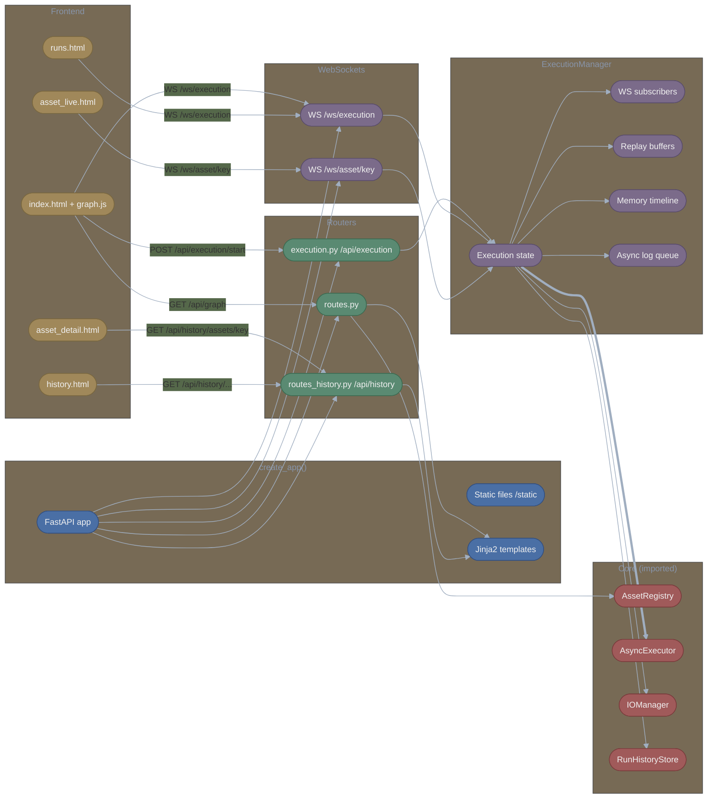
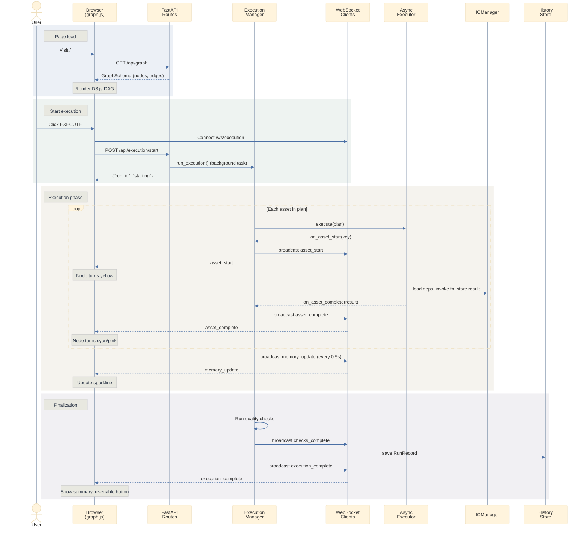
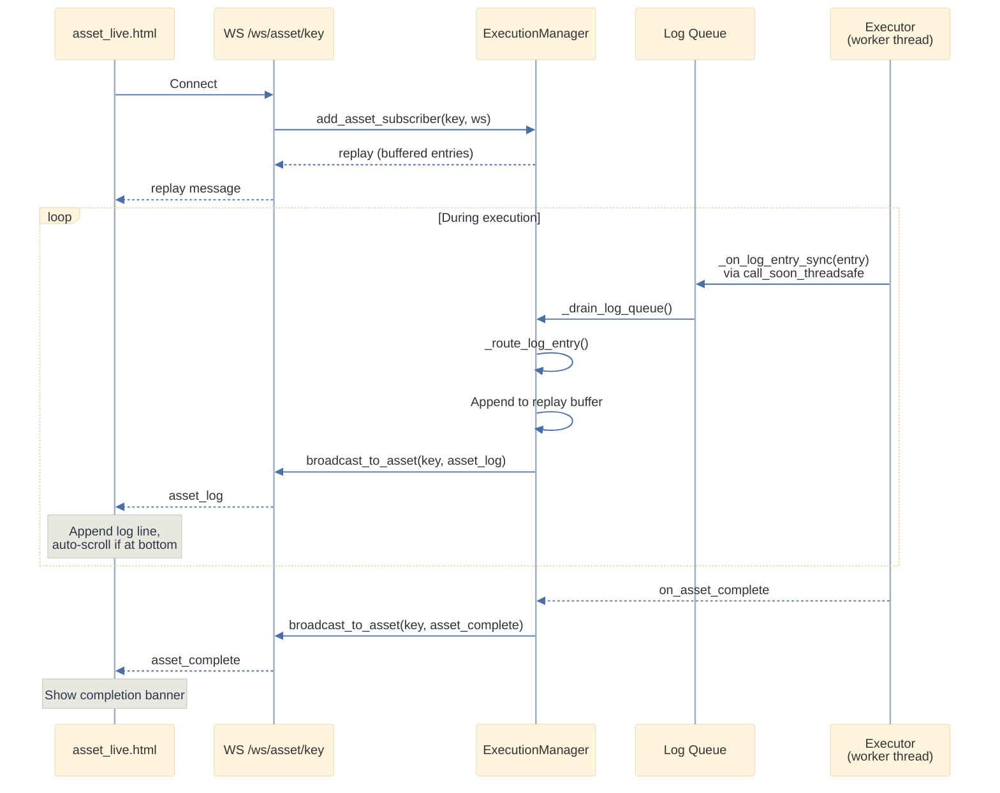
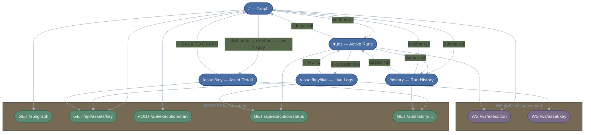

# Lattice Web Service Architecture

This document outlines how the Lattice web service layer interacts, covering the FastAPI application, REST API routes, WebSocket broadcasting, Jinja2 templates, and D3.js frontend visualization. Core orchestration internals are documented separately in [core_architecture.md](core_architecture.md).

---

## Table of Contents

1. [Module Overview](#module-overview)
2. [FastAPI Application Factory](#fastapi-application-factory)
3. [REST API Routes](#rest-api-routes)
4. [WebSocket Architecture](#websocket-architecture)
5. [Frontend](#frontend)
6. [Diagrams](#diagrams)

---

## Module Overview

```
src/lattice/web/
├── app.py                  # FastAPI app factory, serve()
├── routes.py               # Graph visualization & asset detail endpoints
├── routes_history.py       # Run history & analytics endpoints
├── execution.py            # ExecutionManager, execution endpoints, WebSocket routes
├── schemas.py              # Graph/Asset API schemas
├── schemas_execution.py    # Execution API schemas
├── templates/
│   ├── base.html           # Shared layout: sidebar rail, theme toggle, corners
│   ├── index.html          # Main D3.js graph visualization
│   ├── runs.html           # Active execution monitoring
│   ├── asset_live.html     # Per-asset live log streaming
│   ├── asset_detail.html   # Asset run history & metrics
│   └── history.html        # Overall run history & analytics
└── static/
    ├── js/graph.js         # LatticeGraph class (D3.js)
    └── css/styles.css      # Muted mission-control theme
```

---

## FastAPI Application Factory

### `create_app()`

`web/app.py` &mdash; Assembles the full FastAPI application.

```python
def create_app(
    registry: AssetRegistry | None = None,
    history_store: RunHistoryStore | None = None,
) -> FastAPI
```

| Step | What it does |
|------|-------------|
| 1 | Creates `FastAPI` instance (title="Lattice", version="0.2.0") |
| 2 | Mounts static files from `web/static/` at `/static` |
| 3 | Configures Jinja2 templates from `web/templates/` |
| 4 | Creates shared `ExecutionManager(history_store=...)` |
| 5 | Mounts **graph/asset router** (`create_router`) |
| 6 | Mounts **execution router** (`create_execution_router`) at `/api/execution` |
| 7 | Mounts **execution WebSocket router** (`create_websocket_router`) |
| 8 | Mounts **asset WebSocket router** (`create_asset_websocket_router`) |
| 9 | Mounts **history router** (`create_history_router`) |

### `serve()`

Convenience function that creates the app and runs it via uvicorn.

```python
def serve(
    registry: AssetRegistry | None = None,
    host: str = "127.0.0.1",
    port: int = 8000,
    history_store: RunHistoryStore | None = None,
) -> None
```

---

## REST API Routes

### Graph & Asset Endpoints (`routes.py`)

#### HTML Pages

| Method | Path | Template | Description |
|--------|------|----------|-------------|
| GET | `/` | `index.html` | Main graph visualization |
| GET | `/runs` | `runs.html` | Active execution monitoring |
| GET | `/asset/{key:path}/live` | `asset_live.html` | Per-asset live log stream |
| GET | `/asset/{key:path}` | `asset_detail.html` | Asset run history |

#### API Endpoints

| Method | Path | Response Schema | Description |
|--------|------|-----------------|-------------|
| GET | `/api/graph` | `GraphSchema` | Full node/edge graph data |
| GET | `/api/assets/{key:path}` | `AssetDetailSchema` | Single asset metadata, deps, dependents, checks |
| GET | `/api/plan` | `PlanSchema` | Execution plan (optional `?target=` query param) |
| GET | `/health` | `HealthSchema` | Health check with version and asset count |

**`GET /api/graph`** builds the graph by iterating all registered assets:
- Each asset becomes a `NodeSchema` with `id`, `name`, `group`, `description`, `return_type`, `dependency_count`, `dependent_count`, and `checks`.
- Each dependency edge becomes an `EdgeSchema` with `source` (dependency) and `target` (dependent).

**`GET /api/assets/{key}`** returns an `AssetDetailSchema` including:
- `dependencies`: list of upstream asset keys.
- `dependents`: list of downstream asset keys (from reverse adjacency).
- `checks`: registered check definitions for this asset.

### Execution Endpoints (`execution.py`)

| Method | Path | Request / Response | Description |
|--------|------|--------------------|-------------|
| GET | `/api/execution/status` | `ExecutionStatusSchema` | Current execution state |
| GET | `/api/execution/memory` | `ExecutionMemorySchema` | Memory usage + timeline |
| POST | `/api/execution/start` | `ExecutionStartRequest` / `ExecutionStartResponse` | Start execution (409 if already running) |

**`POST /api/execution/start`** request body:

| Field | Type | Default | Description |
|-------|------|---------|-------------|
| `target` | `str \| None` | `None` | Target asset key |
| `include_downstream` | `bool` | `False` | Include downstream dependents |
| `execution_date` | `date \| None` | `None` | Partition date |
| `execution_date_end` | `date \| None` | `None` | End date for range execution |

The endpoint queues `manager.run_execution()` as a FastAPI background task and returns immediately.

### History Endpoints (`routes_history.py`)

| Method | Path | Response Schema | Description |
|--------|------|-----------------|-------------|
| GET | `/history` | HTML | Run history page |
| GET | `/api/history/runs` | `RunListSchema` | Paginated run list (`?limit=`, `?offset=`, `?status=`) |
| GET | `/api/history/runs/{run_id}` | `RunDetailSchema` | Full run details (logs, lineage, checks, assets) |
| GET | `/api/history/summary` | `HistorySummarySchema` | Aggregated stats by asset and partition |
| GET | `/api/history/assets/{key:path}` | `AssetHistorySchema` | Per-asset run history with check counts |
| DELETE | `/api/history/runs/{run_id}` | `{"deleted": bool}` | Delete a run record |

All history endpoints gracefully return empty results when `history_store` is `None`.

### API Schemas

**Graph schemas** (`schemas.py`):

| Schema | Key Fields |
|--------|------------|
| `NodeSchema` | `id`, `name`, `group`, `description`, `return_type`, `dependency_count`, `dependent_count`, `checks` |
| `EdgeSchema` | `source`, `target` |
| `GraphSchema` | `nodes: list[NodeSchema]`, `edges: list[EdgeSchema]` |
| `AssetDetailSchema` | `id`, `name`, `group`, `dependencies`, `dependents`, `checks` |
| `CheckSchema` | `name`, `description` |
| `PlanStepSchema` | `order`, `id`, `name`, `group` |
| `PlanSchema` | `target`, `steps`, `total_assets` |
| `HealthSchema` | `status`, `version`, `asset_count` |

**Execution schemas** (`schemas_execution.py`):

| Schema | Key Fields |
|--------|------------|
| `AssetStatusSchema` | `id`, `status`, `started_at`, `completed_at`, `duration_ms`, `error` |
| `ExecutionStatusSchema` | `is_running`, `run_id`, `current_asset`, `total_assets`, `completed_count`, `failed_count`, `asset_statuses` |
| `MemorySnapshotSchema` | `timestamp`, `rss_mb`, `vms_mb`, `percent` |
| `ExecutionMemorySchema` | `current`, `peak_rss_mb`, `timeline` |
| `ExecutionStartRequest` | `target`, `include_downstream`, `execution_date`, `execution_date_end` |
| `ExecutionStartResponse` | `run_id`, `message` |
| `WebSocketMessage` | `type`, `data` |

**History schemas** (`routes_history.py`):

| Schema | Key Fields |
|--------|------------|
| `RunSummarySchema` | `run_id`, `started_at`, `status`, `duration_ms`, `total_assets`, `completed_count`, `failed_count` |
| `RunDetailSchema` | Extends summary with `logs`, `lineage`, `check_results`, `asset_results` |
| `RunListSchema` | `runs`, `total`, `limit`, `offset` |
| `AssetSummarySchema` | `asset_key`, `total_runs`, `passed_count`, `failed_count`, `avg_duration_ms` |
| `AssetRunSchema` | `run_id`, `asset_status`, `asset_duration_ms`, `checks_passed`, `checks_total` |
| `AssetHistorySchema` | `asset_key`, `total_runs`, `passed_count`, `failed_count`, `runs` |
| `PartitionSummarySchema` | `partition_key`, `total_runs`, `completed_count`, `failed_count`, `total_duration_ms` |
| `HistorySummarySchema` | `asset_summaries`, `partition_summaries`, `total_runs`, `total_passed`, `total_failed` |

---

## WebSocket Architecture

### ExecutionManager

`execution.py` &mdash; Singleton managing execution state, WebSocket subscriptions, memory tracking, and async log routing.

```python
ExecutionManager(
    max_concurrency: int = 4,
    history_store: RunHistoryStore | None = None,
    check_registry: CheckRegistry | None = None,
)
```

**Internal state:**

| Field | Type | Purpose |
|-------|------|---------|
| `_is_running` | `bool` | Execution in progress flag |
| `_executor` | `AsyncExecutor \| None` | Current executor instance |
| `_websockets` | `set[WebSocket]` | Global execution subscribers |
| `_asset_subscribers` | `dict[str, set[WebSocket]]` | Per-asset log subscribers |
| `_replay_buffers` | `dict[str, deque[dict]]` | Per-asset log replay (max 500 entries) |
| `_memory_timeline` | `list[MemorySnapshotSchema]` | RSS snapshots (last 100) |
| `_peak_rss_mb` | `float` | Peak memory during current run |
| `_log_queue` | `asyncio.Queue` | Thread-safe bridge for log entries |
| `_drain_task` | `asyncio.Task` | Async task processing log queue |
| `_base_io_manager` | `MemoryIOManager \| None` | Shared IO manager (persists across partitions) |

**Key methods:**

| Method | Description |
|--------|-------------|
| `add_websocket(ws)` / `remove_websocket(ws)` | Manage global subscribers |
| `add_asset_subscriber(key, ws)` / `remove_asset_subscriber(key, ws)` | Manage per-asset subscribers |
| `broadcast(message)` | Send JSON to all global subscribers (removes dead sockets) |
| `broadcast_to_asset(key, message)` | Send JSON to asset-specific subscribers |
| `get_replay_buffer(key)` | Return buffered log entries for late joiners |
| `record_memory_snapshot(snapshot)` | Append to timeline, update peak |
| `run_execution(registry, target, ...)` | Full execution lifecycle (see below) |

### `run_execution()` Lifecycle

```python
async def run_execution(
    self,
    registry: AssetRegistry,
    target: str | None,
    include_downstream: bool = False,
    execution_date: date | None = None,
    execution_date_end: date | None = None,
) -> None
```

1. **Plan** &mdash; Resolve `ExecutionPlan` from registry with optional target.
2. **Init** &mdash; Reset memory timeline, clear replay buffers, start log drain task.
3. **Per-date loop** (single date or date range):
   - Broadcast `partition_start` message.
   - Create `LineageTracker` and wrap IO manager with `LineageIOManager`.
   - Create `AsyncExecutor` with callbacks wired to broadcast.
   - Execute plan. Callbacks broadcast `asset_start` and `asset_complete` in real-time.
   - Run data quality checks on completed assets.
   - Broadcast `checks_complete` with results.
   - Save `RunRecord` to history store (if configured).
   - Broadcast `partition_complete`.
4. **Finalize** &mdash; Broadcast `execution_complete` with aggregate stats. Clean up log queue and drain task. Call `stop_execution()`.

### WebSocket Endpoints

#### `WS /ws/execution` &mdash; Global Execution Updates

- On connect: register with `add_websocket()`.
- While execution is running: send `memory_update` messages every 0.5 seconds with RSS/VMS/percent from `psutil`.
- Receives broadcast messages: `asset_start`, `asset_complete`, `partition_start`, `partition_complete`, `checks_complete`, `execution_complete`.
- On disconnect: unregister with `remove_websocket()`.

#### `WS /ws/asset/{key:path}` &mdash; Per-Asset Log Streaming

- On connect: register with `add_asset_subscriber()`.
- **Replay**: immediately sends buffered log entries (up to 500) as a single `replay` message so late joiners catch up.
- Receives routed messages: `asset_log`, `asset_start`, `asset_complete`.
- On disconnect: unregister with `remove_asset_subscriber()`.

### WebSocket Message Types

| Type | Direction | Data Fields | Description |
|------|-----------|-------------|-------------|
| `asset_start` | Server -> Client | `asset_id` | Asset execution began |
| `asset_complete` | Server -> Client | `asset_id`, `status`, `duration_ms`, `error` | Asset finished |
| `memory_update` | Server -> Client | `timestamp`, `rss_mb`, `vms_mb`, `percent` | Memory snapshot |
| `partition_start` | Server -> Client | `current_date`, `current_date_index`, `total_dates` | Date partition began |
| `partition_complete` | Server -> Client | `date`, `status`, `duration_ms`, `completed_count`, `failed_count` | Date partition finished |
| `checks_complete` | Server -> Client | `total`, `passed`, `failed`, `results[]` | Quality checks done |
| `execution_complete` | Server -> Client | `run_id`, `status`, `duration_ms`, `completed_count`, `failed_count`, `total_dates` | Full run finished |
| `asset_log` | Server -> Asset WS | `asset_key`, `level`, `message`, `timestamp`, `logger_name` | Log entry routed to asset |
| `replay` | Server -> Asset WS | `entries[]` | Buffered log replay for late joiners |

### Async Log Routing

Log entries flow from worker threads to WebSocket clients through a thread-safe bridge:

1. `ExecutionLogHandler.emit()` fires `_on_log_entry_sync()` from executor worker threads.
2. `_on_log_entry_sync()` uses `loop.call_soon_threadsafe()` to put entries on an `asyncio.Queue`.
3. `_drain_log_queue()` async task reads from the queue and calls `_route_log_entry()`.
4. `_route_log_entry()` builds an `asset_log` message, appends to the replay buffer (capped at 500), and broadcasts to asset subscribers.

---

## Frontend

### Template Hierarchy

All pages extend `base.html` which provides:
- **Sidebar rail** (52px left nav) with 3 icons: Graph (`/`), Runs (`/runs`), History (`/history`).
- **Theme system**: dark mode default, toggled via button, persisted in `localStorage`.
- **Corner decorations**: fixed 60px accent elements at all four corners with glow effects.
- **Template blocks**: `title`, `head_extra`, `body_class`, `main_class`, `content`, `scripts`.

### Pages

#### `index.html` &mdash; Graph Visualization

The main dashboard. Loads `graph.js` (with cache buster `?v=18`) and the D3.js CDN.

| Element | Description |
|---------|-------------|
| Header bar | Logo with glow, title, nav links, node count, relayout button, theme toggle |
| SVG graph | Full-viewport D3.js force-directed DAG |
| Right sidebar | Slides in on node click with asset details, deps, checks |
| Loading overlay | Triple-ring spinner shown during initial data fetch |
| Execution controls | Bottom-right: date picker (single/range), execute button |
| Memory panel | Bottom-left: current/peak RSS, sparkline chart (hidden until execution starts) |
| Progress indicator | Current asset name, counter, spinner (hidden until execution starts) |

#### `runs.html` &mdash; Active Runs

| State | What's shown |
|-------|-------------|
| Loading | "CONNECTING..." spinner |
| Live | Progress bar, per-asset status list (links to `/asset/{id}/live`), live updates via WS |
| Idle | Last run summary grid (run ID, duration, assets, target) |

Transitions between Live and Idle based on `execution_complete` / `asset_start` WebSocket messages and `GET /api/execution/status` on page load.

#### `asset_live.html` &mdash; Live Log Streaming

Real-time log viewer for a single asset during execution.

| Feature | Detail |
|---------|--------|
| Log rendering | XSS-safe via `textContent`; color-coded by level (DEBUG, INFO, WARNING, ERROR, CRITICAL) |
| Auto-scroll | Only when user is at bottom; pauses when scrolled up |
| DOM cap | Max 2000 log entries; oldest removed when exceeded |
| Replay | On connect, receives buffered entries via `replay` message |
| Completion banner | Shows status, duration, and error (if failed) |
| Connection indicator | Green dot (connected) / red dot (disconnected) |

#### `asset_detail.html` &mdash; Asset Run History

Shows a single asset's performance over time.

| Section | Content |
|---------|---------|
| Asset header | Name, group badge, description, return type, dependency/dependent links, check badges |
| Stat cards | Total runs, passed, failed, avg duration |
| Run history table | Run ID, date, partition, asset status, duration, check counts |
| Modal | Full run details filtered to this asset (asset results, checks, logs, lineage) |

#### `history.html` &mdash; Run History

High-level analytics dashboard.

| Section | Content |
|---------|---------|
| Stat cards | Total runs, passed, failed, success rate |
| Asset summary table | Per-asset: runs, passed, failed, last run, avg duration |
| Partition summary table | Last 7 partitions: runs, completed, failed, total duration |
| Recent runs table | Filterable by status; clickable for modal details |
| Modal (4 tabs) | ASSETS, CHECKS, LOGS, LINEAGE |

### `graph.js` &mdash; LatticeGraph Class

D3.js force-directed graph visualization with real-time execution monitoring.

#### Initialization

```
constructor(container)
  -> setupSVG()           // Create SVG, measure viewport
  -> setupZoom()          // d3.zoom, scale 0.1-4x, initial center at 0.8x
  -> setupDefs()          // Gradients, glow filters, arrow markers
  -> loadData()           // GET /api/graph -> nodes[], edges[]
  -> render()             // Draw edges (glow + main layers), nodes, labels, check slivers
  -> setupEventListeners()// Click, hover, drag, theme toggle, relayout, keyboard (Escape)
  -> setupExecutionUI()   // Date picker, execute button, memory panel, progress indicator
  -> hideLoading()        // Fade out spinner overlay
```

#### Hierarchical Layout

`computeHierarchicalLayout()` positions nodes in a left-to-right DAG:
- Computes level per node: `level = max(dependency levels) + 1` (sources = level 0).
- Horizontal spacing: 200px between levels.
- Vertical spacing: 80px between nodes at the same level.
- Locks all nodes (`fx`, `fy`) so the force simulation doesn't animate.

#### Node Rendering

- **Shape**: Rounded rectangle, width measured from text (min 130px + 28px padding).
- **Fill**: Radial gradient per group (5 palettes: default/purple, analytics/teal, data/rose, ml/amber, etl/coral).
- **Glow**: Drop-shadow matching group color.
- **Check slivers**: 4px-wide vertical bars stacked on the right edge, one per registered check.
- **Status classes** (applied during execution):
  - `.status-running`: Animated dashed yellow border.
  - `.status-completed`: Solid cyan border with glow.
  - `.status-failed`: Solid pink border, pulsing opacity.
  - `.status-skipped`: Faded to 0.3 opacity.

#### Edge Rendering

Two-layer rendering per edge:
1. **Glow layer**: wider stroke, low opacity, Gaussian blur filter.
2. **Main layer**: gradient stroke (source group color -> target group color).

Path generation uses quadratic bezier for mostly-horizontal edges and cubic bezier (S-curve) for edges with vertical offset. Paths connect from the right edge of the source (past check slivers) to the left edge of the target.

#### Interactions

| Interaction | Behavior |
|-------------|----------|
| **Hover node** | Show tooltip (name, group, return type); fade unconnected nodes to 0.3; intensify connected edge glows |
| **Click node** | Open sidebar with full asset details (`GET /api/assets/{id}`); update execute button label |
| **Drag node** | Temporarily unlock, reposition, re-lock at new position |
| **Click background** | Deselect node, close sidebar |
| **Escape key** | Close sidebar |
| **Relayout button** | Recompute hierarchical positions, re-lock all nodes |
| **Theme toggle** | Switch `.dark` / `.light` on `<html>`, persist to `localStorage` |

#### Execution Flow

1. User clicks **EXECUTE** (or **EXECUTE FROM {node}** / **RE-EXECUTE FROM {node}**).
2. WebSocket connects to `/ws/execution`.
3. `POST /api/execution/start` with target, dates, include_downstream.
4. WebSocket messages update node status classes, memory sparkline, progress counter.
5. On `execution_complete`, show summary and re-enable button.

#### Memory Display

- **Sparkline**: SVG path + gradient fill tracking last 100 RSS samples.
- **Stats**: Current RSS and peak RSS in MB.
- Panel hidden by default, shown during execution.

### `styles.css` &mdash; Theme System

**CSS custom properties** drive the entire theme. Dark mode is the default on `:root`; light mode overrides via `.light`.

| Category | Dark Mode | Light Mode |
|----------|-----------|------------|
| Background | `--bg-void: #0a0a0f` | `--bg-void: #f5f4f7` |
| Surface | `--bg-surface: #12121a` | `--bg-surface: #fafafa` |
| Text | `--text-primary: #d4d4e8` | `--text-primary: #3d3d4a` |
| Pink accent | `--neon-pink: #c45270` | `--neon-pink: #b85570` |
| Cyan accent | `--neon-cyan: #68b5c2` | `--neon-cyan: #4a9daa` |
| Purple accent | `--neon-purple: #8068a8` | `--neon-purple: #7d62a8` |
| Borders | `--border-dim: rgba(104,181,194,0.18)` | `--border-dim: rgba(107,84,144,0.12)` |

**Key animations**: `logoGlow` (breathing logo), `borderRotate` (running node dashes), `nodeFailed` (pulsing failed node), `btnPulse` (execute button glow), `loaderSpin` (spinner rings).

---

## Diagrams

### Component Diagram



### Web Execution Lifecycle



### Per-Asset Log Streaming



### Page Navigation Map


